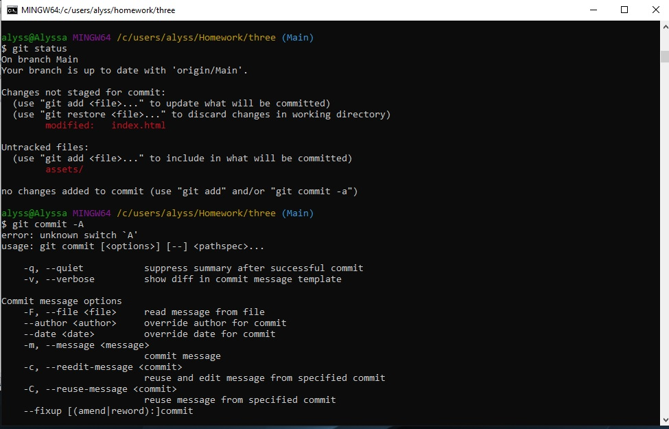
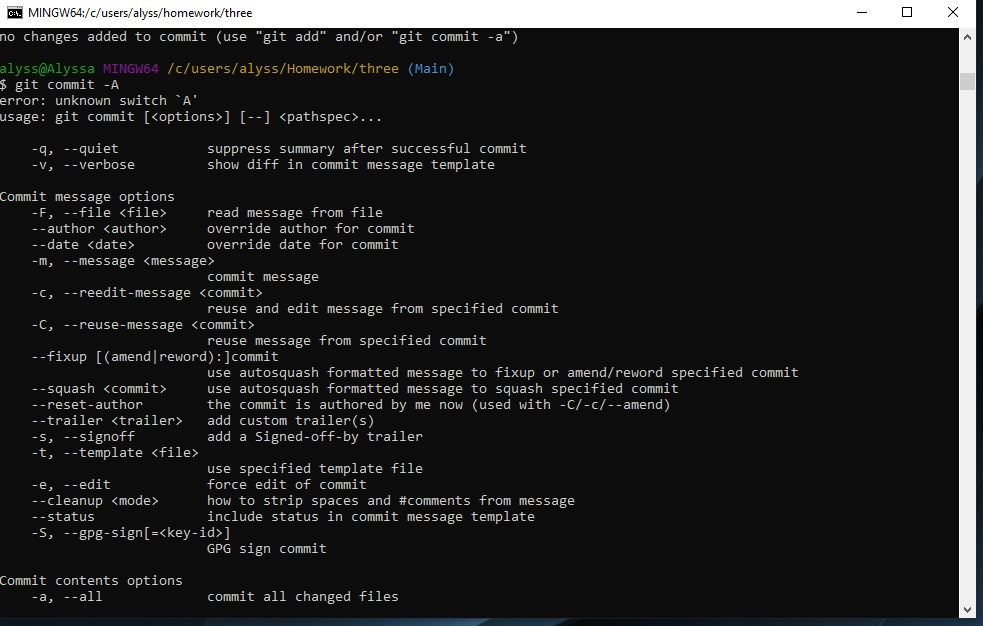
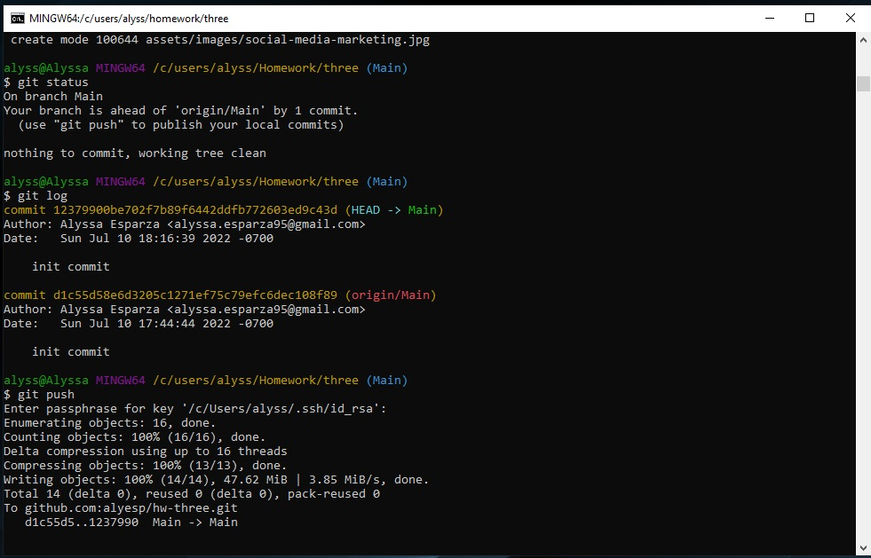
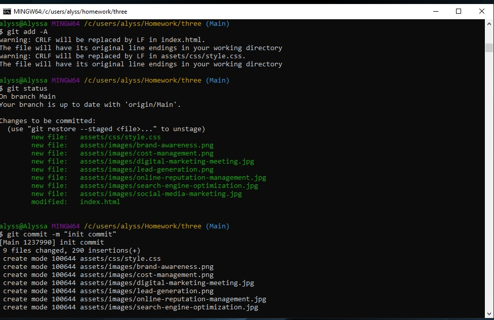

# hw-three

In this assignment we were asked to make sure that the HTML was in logical structure independent of styling and posisitoning. Also, that the user can find accessible alt attributes.
We were asked to make it look cleaner than how we left it for the next person, so that the code can be used and easy to read if any changes need to be made. 

This project was to show us how to make it easier for people other people to read out code and to make it so that the we can change the code to make it user friendly for screen users to use on any device. 

How I changed the code to make it more consice and have logical structure was to add some more syntaxs such as a nav, section, header, and footer, this was added to make the reader know what was going on in each section. Also, some of the CSS could have been combined to make it easier to read.

